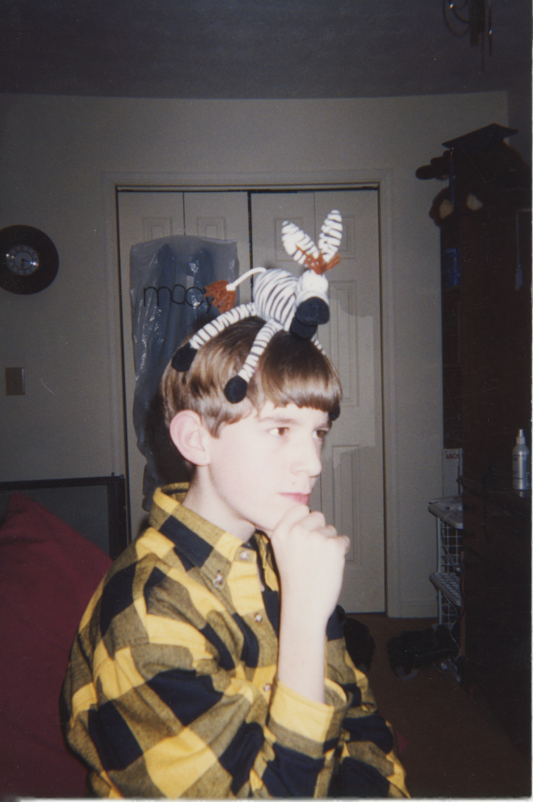

## About the Author

**Thomas Butler** is a software engineer in Atlanta, Georgia, where he spends his days writing code and his evenings explaining to people that yes, the book is about stuffed animals, and no, he is not kidding. Before that, he was briefly a private investigator. He does not like to talk about it.

He grew up in Duluth, Georgia, where in the summer of 1997 he made a promise to his sister involving a disposable camera and a handful of stuffed animals. He kept the promise. It just took a while.

His mother has asked him to clarify that she was asked to edit the book, not "just take a look." He maintains his version of events. She is almost certainly right.

*Forty Seconds* is his first book. He is already behind on the second.
