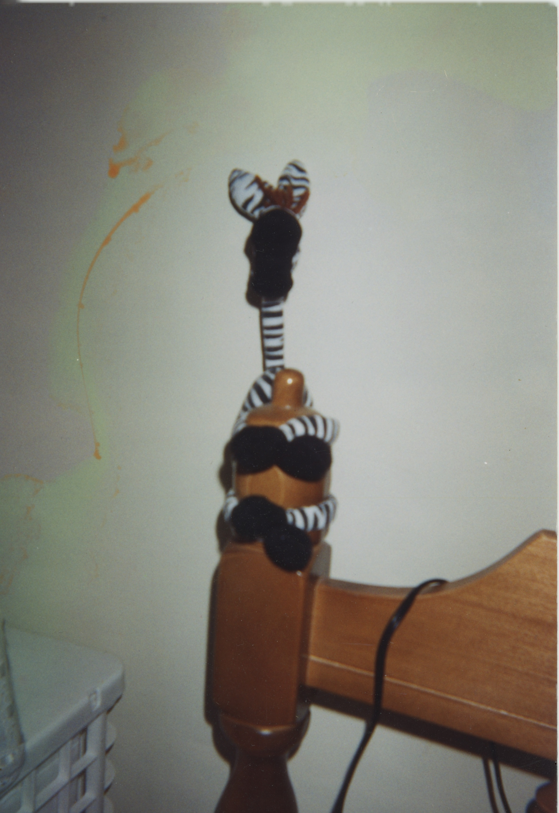
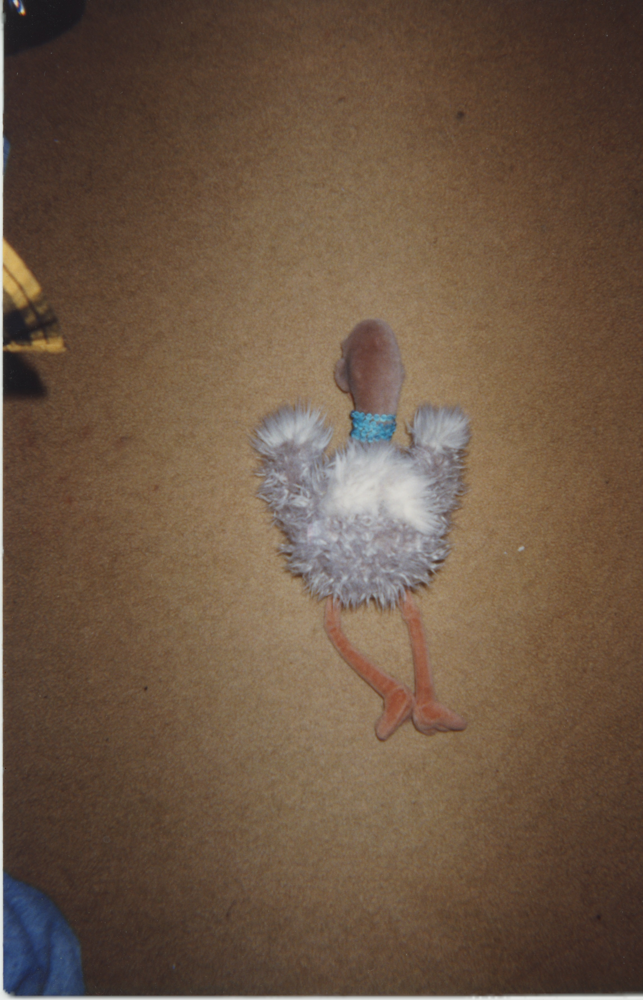
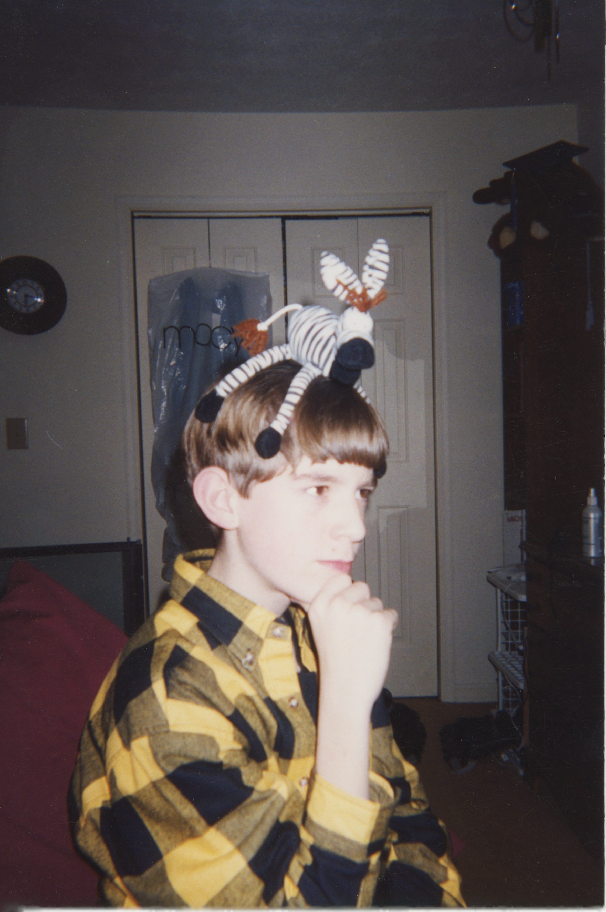
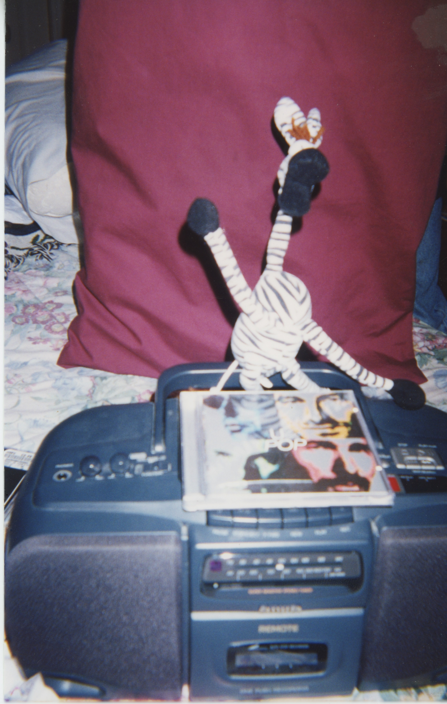
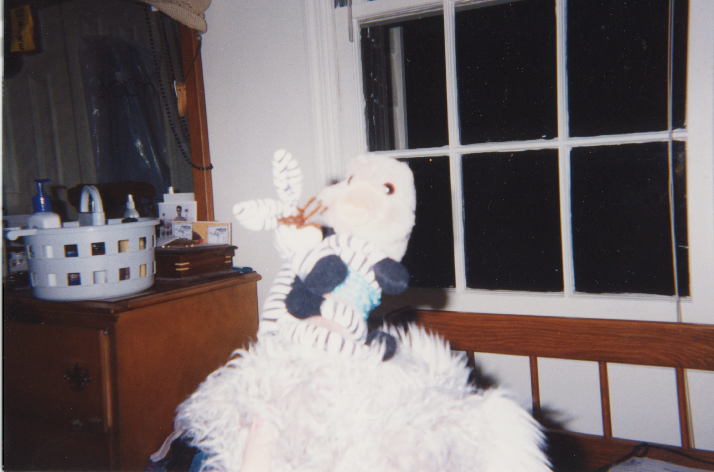
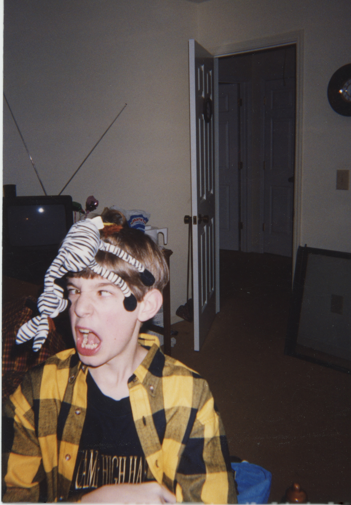
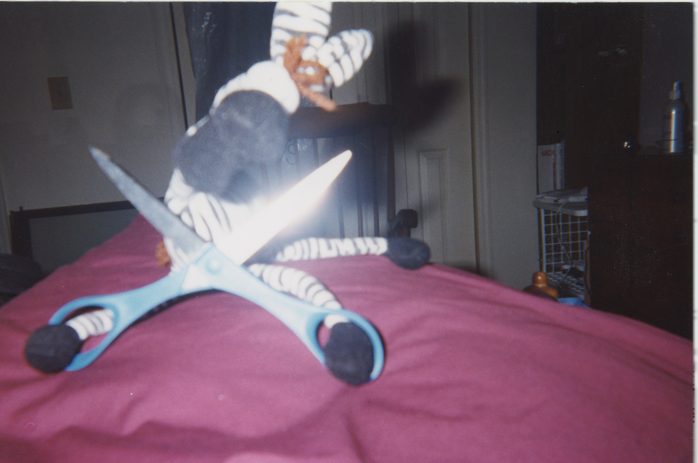
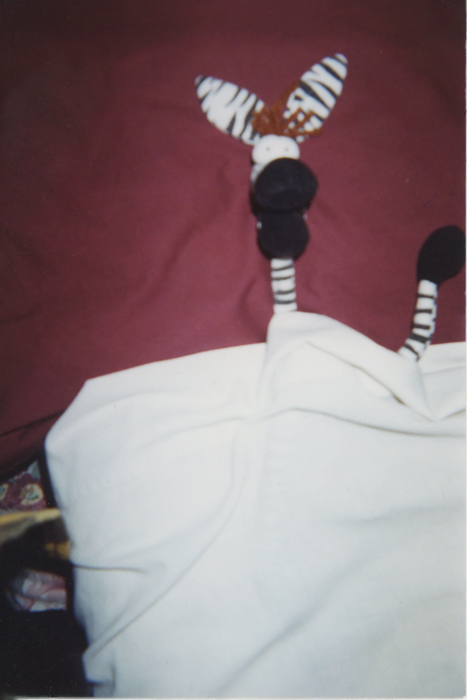

# **Forty Seconds**
### *A Detective Noir*

---

It was a Monday like any Monday. Grey sky, grey city, grey coffee going cold on the counter. Francois had been away for the weekend — business, he'd say later, though nobody asked twice. He turned his key in the lock, pushed open the door, and stepped inside.

What he saw stopped him cold.

The room had been disturbed. Something was wrong. Something was *deeply, fundamentally wrong* in a way that a man feels in his chest before his brain has caught up. Francois's legs went out from under him. He grabbed the nearest bedpost and held on like a man clinging to a life raft in a black ocean.

He called the police with trembling fingers.

They arrived within the hour — two uniforms, bored on a Monday, expecting a noise complaint or a missing wallet. What they found was Francois, still attached to the furniture, eyes wild, unable to speak in full sentences.

*"In there,"* he managed. *"The next room. She's — I can't — just go look."*

They looked.

She was on the floor. Face down. Arms out. Not moving. Not breathing. A stuffed ostrich in a teal collar who went by the name Vivian Plume, and who would never again make anyone's acquaintance.

The officers exchanged a glance.

The lead officer snapped his notebook shut. *"We'll file a report,"* he said, in the tone of a man who was already thinking about lunch.

Francois knew then that the police weren't up to this. This wasn't a case for procedure, for forms in triplicate, for men who solved things with clipboards. This case required a different kind of mind. A darker one. One that had stared into the abyss long enough that the abyss had started leaving him voicemails.

There was only one man.

PI Tom.

---

Tom heard him out without expression. Then he said no.

Francois asked why.

Tom didn't answer that. What he didn't say — what he wouldn't say to a client, or a stranger, or frankly anyone — was that he'd been hearing things for the better part of a year. Whispers, mostly. The kind that travel through the back channels of the city, cop to cop, case to cold case, spoken quietly over bad coffee in rooms with the door closed. Something was going around. Something that got into people. Not a sickness, not exactly — more like a *reorientation.* Men and women who by all accounts had been perfectly ordinary, perfectly decent, until one day they simply weren't anymore. The ones who could still talk afterwards struggled to describe the before and after. The ones who couldn't talk anymore were the ones that kept Tom up at night.

He'd steered clear of anything that smelled like it for months. And something about the shape of this case — a senseless death, a man clinging to furniture, eyes that were just slightly too wide — smelled exactly like it.

So he said no.

But Francois was persistent. He leaned in, voice low and urgent, chipping away — planting small seeds of doubt, little splinters of argument that lodged themselves just under the skin. *What if the police botch it? What if justice is never served? What if the truth just disappears, like she did?* He paused. Something almost conversational entered his voice. *"It's no secret,"* he said, *"that a conscience can sometimes be a pest. Mine has been keeping me up for three days straight."* His eyes found Tom's again.

Then he stopped. Just for a moment — half a second, maybe less. His face went somewhere else entirely. Not grief, not urgency. Something that looked, just briefly, almost like terror. Then it was gone, and he was back, hands clasped, eyes searching Tom's face like nothing had happened.

Tom filed it away alongside the other thing that was bothering him — the thing he couldn't name. He'd spent twenty years developing an instinct, and the instinct was making noise. Francois said all the right things in all the right order, and his devastation seemed genuine, and none of that stopped the quiet alarm going off somewhere below Tom's conscious mind. A man in genuine shock didn't argue this well. A man in genuine shock didn't land his points this cleanly. Tom had the distinct and unverifiable sense of being steered.

He should have walked away. He knew he should have walked away.

*"I just need to know who did this,"* Francois said. *"Francois deserves that much."*

Tom sat with his fist pressed hard against his chin, eyes fixed on the middle distance. Two alarm systems going off at once. The instinct. The rumors. The shape of the thing. He turned it all over, looking for the angle that made it make sense, looking for the solid ground of reason in a conversation that kept moving the floor on him.

Finally, something gave.

*"Fine,"* he said. *"But I do this my way."*

He would spend a long time afterwards wondering what exactly had moved him. He never found a satisfying answer.

---

Tom worked the case for three days straight. He turned over every rock, rattled every cage, followed every thread until the threads led somewhere ugly. And they always led somewhere ugly.

Everyone he talked to said she'd been worried about Francois for weeks. Nobody had done anything about it, including her.

He started with the boombox.

It sat on the bed like an altar. A U2 CD loaded in the tray. Tom stared at it for a long moment before he did anything else. Then he pressed play.

He listened for forty seconds. Then he pressed stop, closed the tray, and stood very still for a long moment.

*So it was true.*

He didn't press play again.

The picture became clear. Francois had found the album. Had listened — once, probably, just to see what all the fuss was about. That's how it always started. Just once. And then the music had gotten into him, into the soft tissue behind his eyes, and it had begun its quiet, patient work. Rewriting things. Darkening corners. Turning a reasonable man into something that could look at Vivian — sweet, harmless, innocent Vivian — and decide she knew too much.

Because she did know. She'd been there when he first listened. She'd seen what it did to him. And a corrupted mind cannot abide a witness.

The conclusion was impossible. Tom ran the logic again. And again. Same answer, every time.

He went back to Francois.

The interrogation was quiet at first. Tom laid out what he knew, piece by piece, watching Francois's face for the cracks. They came slowly, then all at once. Francois looked out the window at the dark nothing beyond the glass.

Then his shoulders dropped.

*"Yes,"* he said quietly. *"I did it."*

He turned to face Tom.

*"I strangled her. A little death, no call and no warning."*

Tom was on his feet before he knew he was standing. Loud, raw, furious. The kind of roar that comes from a man who has spent three days turning over rocks and doesn't like a single thing he found underneath them.

*"WHY? HOW COULD YOU DO THIS? WHAT COULD HAVE POSSIBLY ENTERED YOUR MIND?!"*

He already knew, of course. He'd pressed play. He'd felt the corruption move through him like cold water — forty seconds of it, quiet and patient and rewriting things. He understood exactly what had entered Francois's mind. He just needed to scream the question into his face until the answer became real.

Francois waited him out. And when the room was quiet again, Tom sat back down. Straightened his jacket. Looked at the man across from him.

And then, because he was the kind of detective who couldn't leave a loose thread, he asked the question that had been sitting at the back of his mind since the very first day.

*"Then why,"* he said slowly, *"did you hire me?"*

Francois said nothing. He turned to the window and stared through it at nothing in particular.

Tom watched him. He thought about the office — the urgency, the arguments, the pressure applied in exactly the right places. A man in genuine shock didn't argue that well. A man in genuine shock didn't land his points that cleanly. He thought about the flash of terror that had crossed Francois's face and vanished before it could be named — not grief, not guilt, something more like a man catching a glimpse of something inside himself that frightened him. He thought about a man who had referred to himself in the third person and hadn't seemed to notice, as though one part of him didn't fully recognise the other as itself.

And then he thought about forty seconds of music moving through him like cold water. He thought about what that same thing, given more time, given *much* more time — given enough time to finish what it started — might do to the architecture of a mind. Whether it would hollow a man out all at once, or whether it would take him room by room, leaving some parts intact while it worked on the others.

And if some part was left intact — smaller, dimmer, running out of time — it would know what had happened. It would need someone to find out. But it couldn't just walk into a police station. The rest of the mind wouldn't allow it.

So it would have to find another way in.

*"You couldn't confess,"* Tom said quietly. *"But part of you needed someone to find out."*

Francois turned from the window. He was quiet for a moment. Then:

*"Do you ever wonder,"* he said, almost to himself, *"what it would take to make an ordinary man do something terrible? Not greed. Not rage. Something quieter than that. Something that gets in and changes the — "* He paused. Seemed to lose the thread for a moment. Then found it again, or found a different one. *"Nothing makes sense. Nothing seems to fit. I know you'd hit out if you only knew who to hit."* Another pause. Shorter this time. *"Something that changes the way a man sees the people around him."*

Tom looked at him for a long time. Something had snagged, briefly, in the middle of all that — three lines that arrived in a different rhythm than the rest, clipped and even, almost recited. He couldn't place it. It wasn't a denial. It wasn't a confirmation. It was the only answer the situation had left room for.

Something moved behind Francois's eyes — deep and complicated, like a light seen from a very long way away.

Then it was gone.

He reached for the nearest weapon.

The scissors.

*Of course it was the scissors.*

---

Tom moved fast. Faster than a man with a zebra on his head had any right to. They collided — Francois lunging, Tom blocking, the scissors clattering sideways as they grappled across the room in a tangle of flannel and stripes and raw desperation.

Francois screamed — something raw and broken, something between a cry and an answer. *"My sorrows — they learned to swim!"* Tom held on. They spun. They crashed. The zebra, impossibly, remained on Tom's head throughout.

---

Some time later, Francois lay on a table, strapped at the wrists and ankles.

The room beyond the observation window was small and clinical. A metal stand beside the table. A single overhead light. Tom stood on the other side of the glass, hands in his pockets, watching. He thought about a cornered thing finding a crack. He thought about a last lit room at the end of a long dark corridor, doing the only thing it could with the time it had left.

Vivian was dead. That was real, and it was terrible, and nothing that came after would change it. But the boombox was in an evidence locker, sealed, tagged, going nowhere. The album had been classified. Nobody else would find it on a shelf somewhere and think *just once, just to see.* The corruption ended here, in this room, with this man on this table.

Someone had made sure of that. The question of who — the man, or the thing the music had made of him — was one Tom suspected he'd be turning over for the rest of his life.

Francois turned his head. Found Tom's eyes through the glass.

And smiled.

He lifted one small striped arm — as far as the strap would allow, the thin tube taped to the crook of his elbow shifting slightly with the motion — and waved, slow and cheerful, with the complete serenity of a man at peace with every single choice he had ever made. When he spoke, his voice came through the speaker above the glass, flat and close, like a voice in a small room.

*"I don't regret a thing. It was all worth it. I'd do anything — anything — to hear a second of those sweet, sweet tunes just one more time."* His eyes didn't leave Tom's. *"Think of the best thing you know. The best real thing. Hold it in your mind."* A pause. The smile didn't change. *"Even better than the real thing."*

Tom looked at him for a long moment.

The corruption, reveling to the end. Or a man who had found the only door left open to him, walked through it, and needed Tom to believe the corruption had been in charge the whole time.

Impossible to know. That was the point.

Tom turned and walked away down the grey corridor. And as he walked, another thought settled over him — quiet, patient, the way the worst thoughts always are. The rumors he'd been hearing for the better part of a year. The reorientation. The ordinary people who became something else. He had always imagined the corrupting force as something out there — something he'd managed to avoid, something he'd been careful around.

But he'd pressed play. Forty seconds. And he'd told himself that was nothing, that he'd stopped in time, that he'd felt it move through him and come out the other side clean.

He thought about the instinct that had told him to walk away — twenty years of detective work making noise he hadn't listened to. He thought about the rumors. Two alarm systems, both going off at once.

He thought about the fact that he hadn't walked away.

He stopped in the middle of the corridor. Stood very still. Hands in his pockets. Staring at the grey nothing ahead of him.

And then, without deciding to, he thought: *time is a train. Makes the future the past. Leaves you standing in the station, your face pressed up against the glass.*

He didn't move.

Those weren't his words. He knew it the same way you know a foreign coin in your pocket before you look at at it — by its weight, by its edge, by the slight wrongness of it against your fingers. He tried to trace the thought back to where it had come from.

Nothing. A gap where the source should be.

The question arrived slowly, the way a cold front arrives. Not a dramatic thing. Just a change in the air.

*What if forty seconds wasn't where it started?*

Behind him, the observation window went dark.

---
*Vivian Plume was buried on a Wednesday. It rained. More people came than had been told to.*

*The album has since been classified.*

*Whether Francois was a villain or the last uncorrupted inch of him saved us all is a question this office is not equipped to answer.*

*But the boombox stays locked up.*

*Let this story serve as a warning.*

**— FIN —**

---

*Written by Thomas Butler*
*Pictures by Rebecca Stewart*
*Edited by Ruth-Ann Butler*
