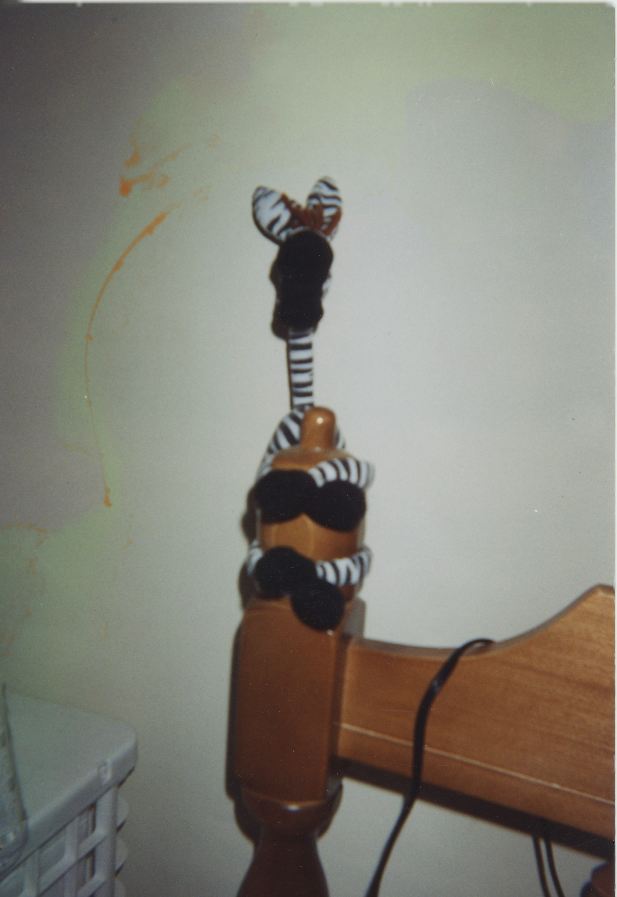
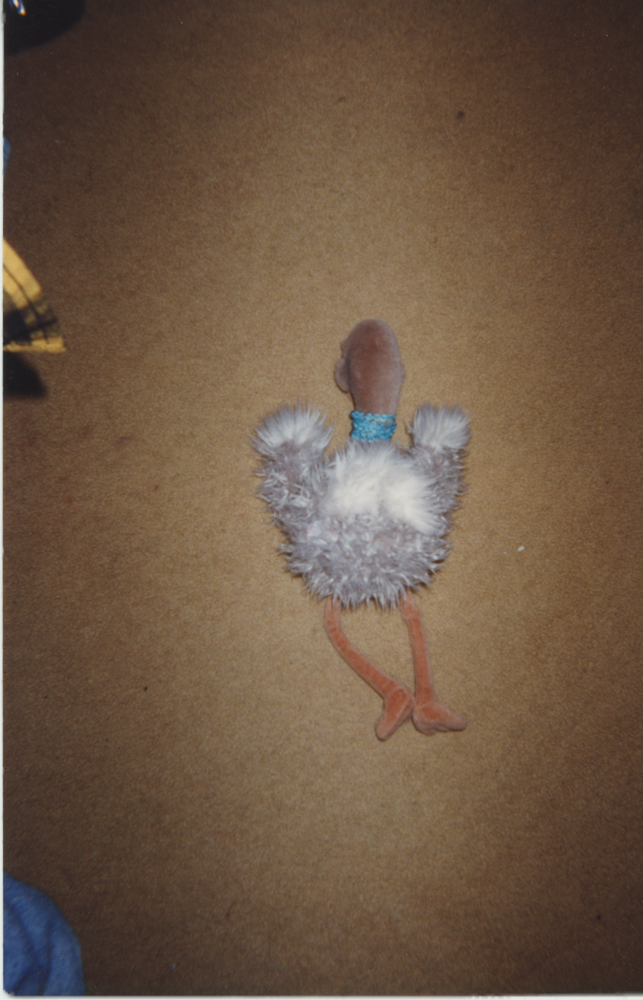
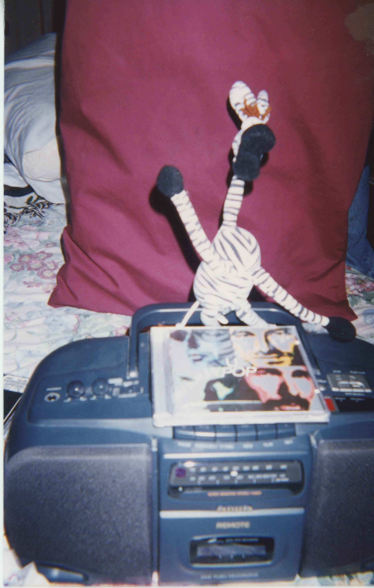
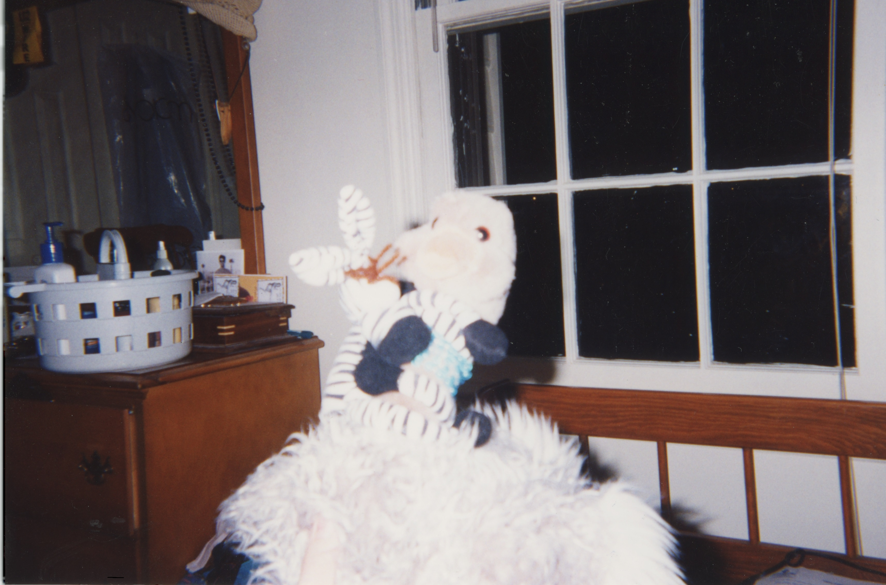
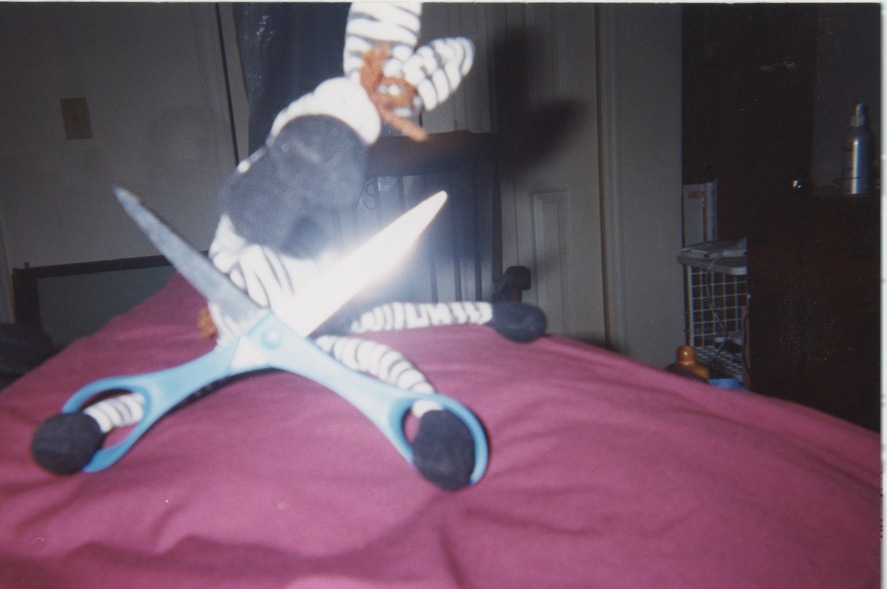
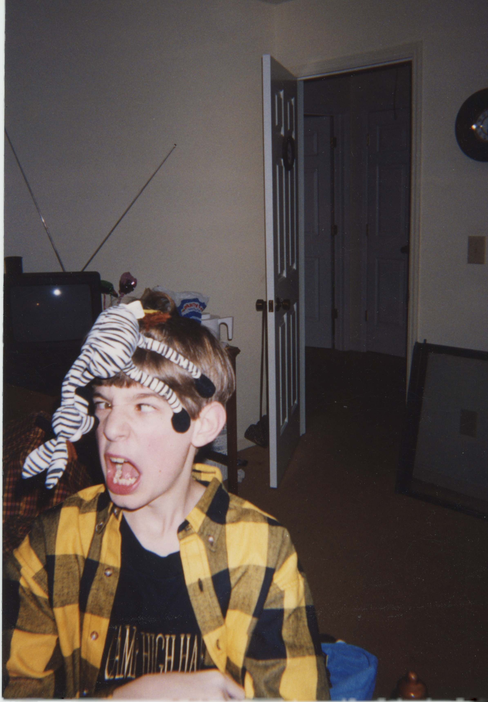
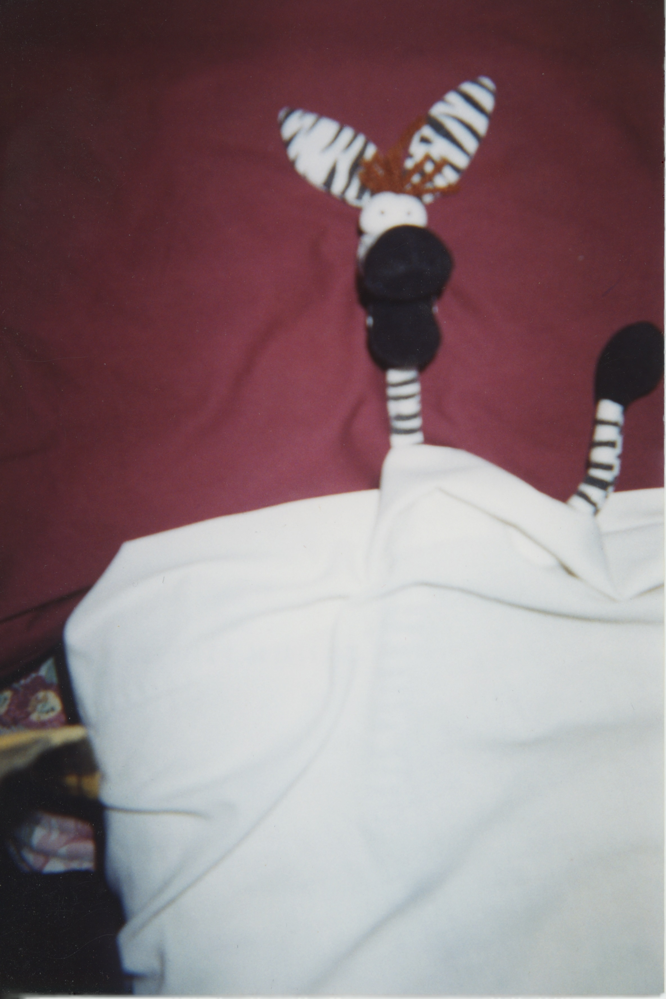

# **Forty Seconds**

*Written by Thomas Butler*

*Pictures by Rebecca Stewart*

*Edited by Ruth-Ann Butler*

## 1

It was a Monday like any Monday. 1997. Grey sky, grey city, grey coffee going cold on the counter. The city had been running a low fever for months — nothing you could point to exactly, nothing that would hold still long enough to diagnose. Just a dull, persistent wrongness that settled into the air like weather and refused to move on. People felt it. Nobody said anything. That was how it always started, in Tom's experience: everybody feeling the same thing, nobody wanting to be the one who named it first.

Francois had been away for the weekend — business, he'd say later, though nobody asked twice. He came back on a Sunday night, coat damp from the rain, key in the lock, the ordinary machinery of return. He stepped inside. He looked at the door to the next room.

Something was *deeply, fundamentally wrong* in a way that a man feels in his chest before his brain has caught up.

Francois's legs went out from under him. He grabbed the nearest bedpost and held on like a man clinging to a life raft in a black ocean.

He called the police with trembling fingers.

They arrived within the hour — two uniforms, bored on a Monday, expecting a noise complaint or a missing wallet. What they found was Francois, still attached to the furniture, eyes wild, unable to speak in full sentences.

"In there," he managed. "The next room. She's — I can't — just go look."

They looked.

She was on the floor. Face down. Arms out. Not moving. Not breathing. A stuffed ostrich in a teal collar who went by the name Vivian Plume, and who would never again make anyone's acquaintance.

The officers exchanged a glance.

The lead officer went through the motions. He walked the room. He noted things in his notebook. He asked Francois questions in the practiced tone of a man who already knows the questions don't matter, because nothing about this case is going to end up requiring much from him. He snapped his notebook shut.

"We'll file a report," he said, in the tone of a man who was already thinking about lunch.

Francois knew then that the police weren't up to this. This wasn't a case for procedure, for forms in triplicate, for men who solved things with clipboards. This case required a different kind of mind. A darker one. One that had stared into the abyss long enough that the abyss had started leaving him voicemails.

There was only one man.

PI Tom.

## 2

Tom's office was on the fourth floor of a building that had been threatening to stop being a building for about fifteen years. The elevator worked on alternating Tuesdays. The window looked out over a section of the city that had never quite recovered from whatever had happened to it in the eighties and had since made its peace with ruin. There was a coffee machine that produced something hot and brown and technically called coffee. Tom drank it every morning and did not enjoy it and kept coming back. Some men had rituals that nourished them. He had this.

He had been a private detective for twenty years. Before that, three years with the department, which had ended in the particular way those things end when a man has a different idea about what the job is than the men above him do. The case he wasn't supposed to keep working on. The files he wasn't supposed to keep. He bore no grudge. The department had its reasons. He had his. They had arrived, mutually, at the arrangement of him not being a part of it anymore.

Twenty years as a private man had taught him one reliable lesson: most of the time, the obvious answer was the answer. Infidelity was infidelity. Theft was theft. The thing that looked like something stranger was almost always, at the bottom, a simple and human thing with a complicated coat of paint over it.

Almost always.

He heard Francois out without expression. Then he said no.

Francois asked why.

Tom didn't answer that. What he didn't say — what he wouldn't say to a client, or a stranger, or frankly anyone — was that he'd been hearing things for the better part of a year. Whispers, mostly. The kind that travel through the back channels of the city, cop to cop, case to cold case, spoken quietly over bad coffee in rooms with the door closed. Something was going around. Something that got into people. Not a sickness, not exactly — more like a *reorientation.* Men and women who by all accounts had been perfectly ordinary, perfectly decent, until one day they simply weren't anymore. The ones who could still talk afterwards struggled to describe the before and after. The ones who couldn't talk anymore were the ones who kept Tom up at night.

He had heard, from a contact in the third district, about a schoolteacher. Kept an orderly classroom, twenty years without incident, wife, two kids, garden. One Tuesday he walked in and wrote a single word on the blackboard and sat down and would not answer any questions. He said nothing that made sense for six weeks. Then one day, just as inexplicably, he was himself again — mostly. The two or three percent that was missing seemed to concern no one but him. The contact had told Tom this in the hallway outside a case that had nothing to do with any of it, dropping the story sideways into the conversation the way you drop something when you want someone else to pick it up.

Tom had not picked it up. He had filed it.

There had been others. A retired butcher in the fourth ward who had taken to walking in careful circles in his garden at three in the morning, singing something in a language he didn't speak, until he simply stopped one day and said he had no memory of any of it. A woman from the city records office who had spent two weeks sending letters to herself addressed to a different name. In each case, the people around them had waited it out, hoping it would pass, because the alternative — that something was doing this to people deliberately, quietly, with patience and intent — was not something a reasonable person wanted to sit with before breakfast.

Tom was not an unreasonable person. But twenty years of the work had made him good at sitting with things most people couldn't. He had sat with a lot of things. He had sat with grief and violence and the particular absence that follows a life ended too soon or too wrong. He had sat, occasionally, with things that had no name. Things that arrived in a case like a footprint in the wrong material, pointing in the wrong direction, that he filed and then found himself returning to months later when a different case opened a door that connected, somehow, to the first.

The accumulation, over the past year, had started opening doors.

He didn't like what they led to.

He glanced at Francois — the too-wide eyes, the hands clasped just a little too tight.

He'd steered clear of anything that smelled like it for months. He'd declined three cases in the past year on nothing more than instinct. He hadn't known how to explain that to the people who'd come to him, hat in hand, needing the work done. He'd said he was busy. He'd said he wasn't taking new clients. He'd said whatever he needed to say to close the door without having to explain what it was he was trying to stay away from.

And something about the shape of this case — a senseless death, a man clinging to furniture, eyes that were just slightly too wide — smelled exactly like it.

So he said no.

But Francois was persistent. He leaned in, voice low and urgent, chipping away — planting small seeds of doubt, little splinters of argument that lodged themselves just under the skin — "What if the police botch it? What if justice is never served? Where is the hope, and where is the faith? What if the truth just disappears, like she did?"[^angels]

He stopped. "Don't try too hard to think," he said. "Don't —"[^staring] He paused. Seemed to lose it briefly. "If there's an order in all of this disorder — I just need to know what it is."[^wake]

Then, just for a moment — half a second, maybe less — something crossed his face. Not grief, not urgency. Something that looked, just briefly, almost like terror. Then it was gone, and he was back, hands clasped, eyes searching Tom's face like nothing had happened.

Tom filed it away — the thing he couldn't name. He'd spent twenty years developing an instinct, and the instinct was making noise. Francois said all the right things in all the right order, and his devastation seemed genuine, and none of that stopped the quiet alarm going off somewhere below Tom's conscious mind. A man in genuine shock didn't argue this well. A man in genuine shock didn't land his points this cleanly. Tom had the distinct and unverifiable sense of being steered.

The other thing — smaller, harder to name — was the rhythm of some of it. The phrasing. Every so often Francois would say something and it would scan differently — like he was receiving the words rather than choosing them. Too even. A little too complete. Like a line from a song, almost — like it had a life that predated the conversation it arrived in.

Tom had noticed this before, with others. With the schoolteacher's wife, who had described the last months of her husband's symptoms in ordinary words, and then once — just once — slipped into something else. A phrase so precisely balanced it sounded composed. She hadn't noticed. She'd carried straight on. He hadn't known then what to make of it. He was beginning to think he understood it now.

He should have walked away. He knew he should have walked away.

"He just needs to know who did this," Francois said. "Francois deserves that much."

Tom sat with his fist pressed hard against his chin, eyes fixed on the middle distance. Two alarm systems going off at once. The instinct. The rumors. He turned the shape of the thing over, looking for the angle that held, looking for the solid ground of reason in a conversation that kept moving the floor on him.

Finally, something gave.

"Fine," he said. "But I do this my way."

He said it, and meant it, and went to the window and looked out at the section of the city that had made its peace with ruin while Francois composed himself behind him. Two alarm systems still going off. The instinct said: *something is wrong with this situation in a way that you cannot name yet.* The rumors said: *you have heard about this kind of wrong before and it was never anything you wanted to be near.*

He looked at the grey city and told himself he had a choice. He could walk away. The word *no* was still an option. It was still available. He had not yet picked up the case.

He turned around. Francois looked at him with those too-wide eyes, and something in Tom settled into the position of a man who has, at some point below his conscious decision-making, already made up his mind.

He had not walked away yet.

He noted that. Filed it. Told himself it meant nothing. He'd taken cases he hadn't wanted to take before. That was the work. You didn't always choose your cases so much as get chosen by them.

## 3

Tom worked the case for three days straight. He followed every thread until the threads led somewhere ugly. And they always led somewhere ugly.

Day one: the police file, which told him almost nothing useful. Two officers, one report, filed with the care and attention of men performing a bureaucratic obligation rather than investigating a death. The language was boilerplate. The observations were minimal. They had noted a boombox. They had not noted what was in it. They had noted that the window was closed. They had not noted the three days of unopened mail. Tom read it twice looking for something he might have missed. There was nothing to miss.

He asked around the precinct — quietly, through the contact in the third district who had told him about the schoolteacher. His contact met him in a parking structure and said: *stay away from this one.* When Tom asked why, his contact said: *because the people who looked at it before you didn't come back looking the same.* Tom asked which people. His contact said he'd already said too much and left.

Tom went back to the file and read it a third time. Nothing new. He closed it and went to find the neighbors.

He started with the neighbors. The woman in the flat below had heard music a week before Vivian's death — something with bass, something American, coming through the ceiling at two in the morning. She'd knocked on the pipes. It stopped. She hadn't thought anything of it until Tom was standing in her doorway asking questions, at which point she thought quite a lot of it. The man across the hall said Francois had come to him the week before and asked if he'd borrowed a ladder. When the man said no, Francois had looked at the ladder propped against his own wall and nodded slowly, as if this answered something. Neither neighbor had seen Vivian in the last ten days of her life.

He asked the woman downstairs: had she seen anything else unusual? Any changes in Francois's behaviour? She thought about it. She said he had stopped checking his post. She knew because she could see the letterbox from her door and it had been filling up for weeks. She said it the way people say things that seem small until the moment they don't.

She also said, almost as an afterthought, that she had run into Vivian in the hall about three weeks before her death. Just in passing. Vivian had said hello and then stopped, as if she'd remembered something, and asked — out of nowhere — if the woman downstairs had noticed anything strange about the music. *What kind of strange,* the woman had asked. *Just strange,* Vivian had said. And then she'd gone upstairs. The woman had not known what to make of it at the time. She'd put it down to neighbourly small talk gone slightly sideways.

Tom noted it. It went with the rest.

He went to the place Vivian had worked. A small office, three people, indoor plants surviving on optimism and infrequent watering. A colleague named Birdie — small, efficient, the kind of person who keeps things running without anyone remembering to thank them — told Tom that Vivian had come in the week before her death with shadows under her eyes. She hadn't slept. She'd been jumpy. At lunch she'd said, unprompted: *I think something has happened to Francois, but I don't know what to do about it because he hasn't done anything. Not yet.*

*Not yet* was the part that stayed with Tom on the walk back.

Birdie had asked what she meant. Vivian had shaken her head and pushed her lunch around the plate and changed the subject. She had talked about something unrelated — the weather, the train being late — with the bright, exhausted focus of a person who has decided not to say the thing they came to say. That was the last time Birdie saw her.

Tom thanked her. He walked out through the drizzle and stood under the awning of a pharmacy while the city moved around him, grey and impatient. September, the streets slick and capsizing, draining everything down into the gutters at the corners.[^please] The kind of afternoon that makes a city feel like something larger is being washed away. He thought about Vivian deciding not to say the thing she came to say, and the days between that lunch and the floor of the next room. He thought about the shape of that gap. About all the things that can happen in the space between *not yet* and the event that makes *not yet* irrelevant.

He lit a cigarette. Let the city be grey around him for a minute.

Before he went back to the rooms, he stopped at a bar two blocks from the building where Francois and Vivian had lived. The kind of place that kept the same hours as loneliness. A man behind the bar who'd served the same corner of the city long enough to know everyone who had ever walked through the door and exactly how their story ended. Tom bought a drink he didn't want and asked what he knew about the man in the flat on the third floor.

The barman set down a glass. Thought about it.

"Came in regular," he said. "Last couple of months, not so much. Before that, him and his girl — the one with the collar — they'd come in Tuesday evenings. Quiet couple. Minded their own. She stopped coming first. Then he stopped. Last time I saw him in here, he sat at the end of the bar for two hours and didn't say anything to anyone and left a coin under his glass that was — " He picked up a cloth. Turned it over in his hands. "It wasn't from anywhere I recognised, is all. I kept it. Seemed wrong to spend it."

Tom asked if he still had it.

The barman produced it from his till — a small coin, older-looking than it had any right to be, with an image on one side that Tom looked at and then looked away from.

He left it where it was.

On the third morning — before he went back to the rooms — he paid a visit to Francois. Not to interrogate. Not yet. Just to look. He'd found, over twenty years, that there was something you could learn from a person's face when they didn't know you were building a picture of them yet. Before they'd had a chance to decide what to show you and what to hide.

Francois was staying with someone — a cousin, apparently, which was the kind of detail that existed in a file but told you almost nothing. He opened the door in a grey shirt and looked at Tom with the eyes of a man who had not been sleeping. The circles under them were deep enough to read by.

They stood in the doorway for a moment.

"Any news?" Francois asked.

"Following some leads," Tom said.

He looked at Francois's hands. They were still. He looked at Francois's eyes. They were not quite still — something moved behind them, barely perceptibly, a current beneath the surface. Tom had seen that before, too. On men who were managing something enormous from the inside. On men who were holding two things at once that couldn't both be true.

"Is there anything else you want to tell me?" Tom said.

Francois looked at him. A long pause. "No," he said. Then, very quietly: "Not yet."

Tom looked at him for one more second. Filed it. Left.

He stood on the pavement outside the cousin's building and lit a cigarette and stood with it for a moment, not thinking, just letting the shape of the conversation arrange itself in his memory. Then he started thinking.

*Not yet.* The same words Vivian had used. He didn't know what to do with that yet. He tucked it in with the rest of the things he didn't know what to do with, and went back to the rooms.

He walked the long way round. The city was running its Monday operations around him — shopfronts, traffic, people with places to be who weren't looking at each other. The kind of morning that asked nothing of you and gave nothing back. Tom had walked this city for twenty years and he knew when it was just being itself and when something underneath it was different. Today it felt like the second thing. A low hum he couldn't place. The low fever, still running.

He thought about Francois's face in the doorway. About the not-quite-stillness behind his eyes. He thought about what it cost a person to say *not yet* and mean two different things by it at the same time — one of them a lie, one of them the closest they'd been to the truth in months. He thought about the fragment of Francois that had found a crack, hired a detective, and now stood in a borrowed flat waiting to be found out.

He didn't know if he pitied it. He decided that was a question for later.

He had enough. He already had enough, if he was honest, and he'd had enough since the second neighbor. But enough wasn't the same as all of it, and all of it was what he needed to understand the shape of the thing properly. So he went through the rooms on the second day.

The rooms told their own story. The bed with its missing occupant — the hollow on Francois's side, the other side undisturbed in a way that suggested it had been undisturbed for some time before Vivian died. A boombox sitting out where a boombox had no particular reason to be. Scissors on a side table. A coffee cup with the remains of something in it, days old by the smell. Three days of unopened mail. Tom went through the mail out of habit. Nothing. Bills, a flyer, something from a library about an overdue book. He put it back.

He was not expecting to find anything useful in the desk drawer.

What he found was a folded piece of paper — not a diary, not a letter. A list. Eight or nine lines in her handwriting, each one something Francois had said. No dates. No context. Just the words, because the words had been strange enough to write down. Most of them Tom couldn't place. But near the bottom, underlined twice, with a question mark beside it: *You know you're chewing bubble gum.*[^discotheque]

He looked at it for a long time. He thought about a woman writing down the things her partner said because they had started to frighten her — not knowing why, not knowing what to do with the list once she had it. Vivian had been careful and precise. She had seen something wrong and done what careful, precise people do: documented it. Kept a record. In case. He thought about the better part of a year he'd spent listening to the city whisper about something that rewrote people quietly, patiently, until one day the words coming out of their mouths weren't theirs anymore.

He thought about *not yet.*

He thought: she knew. She'd known for weeks and she hadn't been able to leave and she hadn't been able to make him stop and she hadn't been able to make anyone else understand what she was seeing. So she'd written it down, and then she had run out of time.

He folded the paper and put it in his pocket.

He turned to the boombox.

It sat on the bed like an altar. A U2 CD loaded in the tray. Tom stood over it, not moving. He knew this smell. He knew what the boombox was. He knew what the boombox had done. He knew what pressing play would mean. The rational, twenty-year version of himself was clear about this. The rational version had an opinion.

His hand moved before he'd decided.

He listened for forty seconds. Then he pressed stop and stood very still for a long moment.

*So it was true.*

He didn't press play again.

He stood in the room and waited for whatever came next. He'd heard things. He'd felt something — undeniable, like a cold hand briefly placed on the back of his neck, then withdrawn. He tested himself the way he'd test a suspect: methodically, without mercy, looking for the inconsistency. His name was Tom. He was a private detective. He was standing in a dead woman's room. He had just heard forty seconds of a piece of music that he now understood, with complete certainty, was responsible for her death. All of these things were still true. He could still count backwards from a hundred without losing track. He still knew what year it was.

He didn't press play again.

He stood there a minute longer, in the sound of the boombox's silence, in the room where Vivian's careful handwriting waited in his pocket, and he told himself it had been forty seconds and he had stopped and it was nothing.

He almost believed it.

The picture became clear. Francois had found the album. Had listened — once, probably, just to see what all the fuss was about. That's how it always started. Just once. And then the music had gotten into him, into the soft tissue behind his eyes, and it had begun its quiet, patient work. Rewriting things. Darkening corners. Turning a reasonable man into something that could look at Vivian — innocent Vivian — and decide she knew too much.

Because she did know. She'd been there when he first listened. She'd seen what it was doing to him. And a corrupted mind cannot abide a witness.

Tom stood in the room and let the pieces hold still long enough to see the whole shape of what he was looking at. He'd worked complicated cases. He'd worked cases where the answer was buried under three layers of misdirection and two layers of bad luck and a layer of something that could only charitably be called coincidence. He'd worked cases that took years to crack and some that had never cracked at all, that sat in the back of a filing cabinet and woke him up sometimes at three in the morning just to let him know they were still there.

He'd never worked a case like this. Where the perpetrator had hired him. Where the thing that hired him wasn't fully in control of itself. Where the question of who had made the decision to bring him in was more complicated than the question of who had committed the crime.

The conclusion was impossible. Tom ran the logic again. And again. Same answer, every time.

He went back to Francois.

---

The interrogation was quiet at first.

He had arranged to meet Francois at the cousin's flat again — somewhere neutral, somewhere without the weight of the rooms where Vivian died. Somewhere Francois might feel he was still on his own ground. That was deliberate. Tom had found, over the years, that people said more when they felt they had some advantage. Give a man the geography and he'd give you the confession.

Tom sat across from him at a table that belonged to neither of them and looked at Francois's hands and his eyes and the way he held himself, and waited.

Tom laid out what he knew, piece by piece, watching Francois's face for the cracks. They came slowly, then all at once.

He set Vivian's list on the table between them. Francois looked at it. His jaw worked. Something moved at the back of his eyes — not recognition exactly, more like the particular stillness of a man who has been handed the evidence he always knew existed.

Tom told him about Birdie. About *not yet.* About what those two words suggested Vivian had seen, and what she'd been afraid to name. He told it without editorial, without inflection, the way you lay out a series of facts when the facts are doing the work and your voice doesn't need to. Francois listened without interrupting. Once, he opened his mouth to say something and closed it again. He looked at the table. He looked at the window. He had the look of a man standing at the edge of something very deep, deciding whether to step back.

"Don't know if I can hold on," Francois said. His voice was different — loose, oddly conversational, like a man reading from something. "Don't know if I'm that strong."[^mansion]

Tom watched him.

"Don't know if I can wait that long." Francois looked at his own hands. "'Til the colours come flashing and the lights go on."[^mansion]

The thread frayed. Something shifted in Francois's face — the lines around his mouth tightened, the distance in his eyes contracted. He was back. The moment had been and gone.

Tom looked at him for a long moment. He noted it. Filed it next to the third-person slip and the terror-flash and the rhythm of the words that arrived too complete. The picture he was building had a shape now. He could see the outline of it. He needed a few more pieces before he could say it out loud.

"Tell me about the album," Tom said.

Francois said nothing.

"The boombox. The U2 CD. Tell me about the first time you listened to it."

A long pause. Francois looked at the table. "I was curious," he said. "Everyone was talking about it. I just wanted to hear what all the — " He stopped. "It was just music."

"And then?"

"And then." Francois looked at the window. He seemed to be trying to find the words for something that didn't have them. "And then I listened again."

Tom waited.

"It's — " Francois stopped. Started again. His voice had gone very flat. "It gets into you. It fills up the parts of you that were already empty. And once it's in, it doesn't — it doesn't come back out. It just stays there and it works. It just keeps working."

He went quiet.

Tom watched him. He thought about what it would feel like to describe something like that. To have to explain to someone, in plain language, what it felt like to lose rooms of yourself one by one to something you'd invited in because you were curious and it seemed harmless. He thought the words *It just keeps working* had the sound of something said from a great distance — words arriving from a place in the man that was still watching, still trying to explain, while the rest of him was somewhere else entirely.

Francois looked out the window at the dark nothing beyond the glass.

Then his shoulders dropped.

"Yes," he said quietly. "I did it."

He turned to face Tom.

"I strangled her. No emotional good night."[^gone]

Tom said nothing.

"Why?"

Francois looked at the window. "She felt the ground was giving way," he said simply. "Better off that way."[^lastnight]

Tom looked at him for a moment. The answer had the shape of something rehearsed — too finished, arrived too easily. He filed it next to the other things he couldn't name.

He sat with it for a minute. The word *why* hung between them in the room, doing the work a word like that does when the answer is obvious and terrible and everyone in the room already knows it. Tom had spent twenty years asking *why*, and in twenty years he had learned that the question was rarely about information. It was about making someone say the thing out loud. Saying a thing out loud was different from knowing it. It changed the texture of it. It made it real in a way that just knowing it didn't.

Francois had said it out loud. Tom let the silence run a little, the way you let silence run when you want a man to understand the full weight of what he's just put into the world. The room held it. The window held it. The dark nothing beyond the glass.

He already knew, of course. He'd pressed play. He'd felt the corruption move through him like cold water — forty seconds of it, quiet and patient and rewriting things. He understood exactly what had entered Francois's mind. He understood the logic of it: Vivian had seen too much. The corrupted mind had concluded that a witness was a liability. There was nothing left in that calculus for grief, for history, for years of a life shared in the same rooms. The corruption didn't grieve. It only solved. It was, in its way, a very clean kind of thinking. That was the worst part of it. That it was so clean.

And then, because he was the kind of detective who couldn't leave a loose thread, he asked the question that had been sitting at the back of his mind since the very first day.

"Then why," he said slowly, "did you hire me?"

Francois said nothing. He turned to the window and stared through it at nothing in particular.

Tom watched him. He thought about the office — the urgency, the arguments, the pressure applied in exactly the right places. He'd thought it then. He thought it again now: a man in genuine shock didn't argue that well. A man in genuine shock didn't land his points that cleanly. He thought about the flash of terror that had crossed Francois's face and vanished before it could be named — not grief, not guilt, something more like a man catching a glimpse of something inside himself that frightened him. He thought about a man who had referred to himself in the third person and hadn't seemed to notice, as though one part of him didn't fully recognise the other as itself.

And then he thought about forty seconds of music moving through him. He thought about what that same thing, given more time, given *much* more time — given enough time to finish what it started — might do to the architecture of a mind. Whether it would hollow a man out all at once, or whether it would take him room by room, leaving some parts intact while it worked on the others.

And if some part was left intact — smaller, dimmer, running out of time — it would know what had happened. It would need someone to find out. But it couldn't just walk into a police station. The rest of the mind wouldn't allow it.

So it would have to find another way in.

It would have to be clever about it. It would have to use the corrupted mind against itself — convince it that hiring a detective was a useful idea, that the detective would find the boombox, press play, become an ally. It would have to be persuasive. Persistent. It would have to argue its case.

Francois turned from the window. He looked at Tom's face. Whatever he saw there, he didn't wait for the sentence that was coming.

He reached for the nearest weapon.

The scissors.

*Of course it was the scissors.*

## 4

Tom moved fast. Faster than a man with a zebra on his head had any right to. They collided — Francois lunging, Tom blocking, the scissors clattering sideways as they grappled across the room in a tangle of flannel and stripes and raw desperation.

Francois screamed — something torn and broken, something between a cry and an answer. "I'm not coming down, I'm not coming down!"[^gone] Tom held on. They spun. They crashed. The zebra, impossibly, remained on Tom's head throughout.

---

Francois's legs went out from under him — the second time that week, and this time there was nothing to hold onto. Tom eased him down. Crouched beside him.

The room was very quiet. Tom's breathing was loud in it. Outside, the city went on being the city — traffic, somewhere, and the sound of rain starting up again against the window. Inside, just the two of them on the floor, and the scattered wreckage of the interrogation, and the scissors lying five feet away where they'd landed.

Tom had been in rooms like this before. Not this exact configuration — there had never, in twenty years of cases, been a situation precisely like this one — but the quality of the silence was familiar. The silence after a thing becomes certain. After the last door closes on any remaining doubt.

He looked at Francois on the floor. A stuffed zebra in a state of complete exhaustion, the fight gone out of him, something in his eyes that might have been relief or might have been grief or might have been, simply, emptiness. Tom had seen that look before too. Usually on men who'd been carrying something enormous for a long time and had finally, finally, been relieved of it. The weight gone, and nothing left to replace it.

Tom's legs had given out when they went down. He crouched on the floor and let them stay given out. Some professional dignity had been sacrificed. He found he didn't mind. He'd spent the last three days chasing through the rooms of something that had no business existing, and a man was allowed, at the end of that, to sit on a floor.

He looked at Francois. He thought about what it would cost a mind — what it would take out of a mind — to do what the uncorrupted fragment had done. To know. To understand. To be trapped inside a body that had committed an act of violence and to have no leverage, no authority, no way to object — just the one last trick, the one last loophole. To convince the thing that had taken you over that hiring a detective was a useful idea. To use the corruption's own logic against it.

He thought: that took something. Whether it was courage or calculation or simply desperation, it took something.

"You couldn't confess," he said. "But part of you needed someone to find out."

Francois said nothing for a moment.

Then something shifted in him — not grief, not defiance. He almost laughed.

"I'm already gone," he said. "Felt that way all along."[^gone]

Tom looked at him for a long time. It wasn't a denial. It wasn't a confirmation. It was the only answer the situation had left room for.

Something moved behind Francois's eyes — like a light seen from a very long way away.

Then it was gone.

Tom sat on the floor a minute longer. He looked at Francois and thought about what the uncorrupted fragment had done, and what it had cost, and what it had understood. He thought about the list in his pocket — about Vivian's careful handwriting, about the words she'd written down because they frightened her. He thought about the two of them: a woman documenting from outside, a fragment documenting from within. Both reaching for the same witness. Both ending the same way.

He stood up. His legs held. Barely, but they held.

## 5

Some time later, Francois lay on a table, strapped at the wrists and ankles.

The room beyond the observation window was small and clinical. A metal stand beside the table. A single overhead light. The kind of room that had been designed to be easy to clean. Tom had been in these rooms before, from this side of the glass — standing with his hands in his pockets, watching, not saying anything. He'd always found them strange. Not cruel. Just final. The architecture of an ending.

He thought about a cornered thing finding a crack. A last lit room at the end of a long dark corridor, doing the only thing it could with the time it had left.

Vivian was dead. That was real, and it was terrible, and nothing that came after would change it. But the boombox was in an evidence locker, sealed, tagged, going nowhere. The album had been censored. Nobody else would find it on a shelf somewhere and think *just once, just to see.* The corruption ended here, in this room, with this man on this table.

Someone had made sure of that. The question of who — the man, or the thing the music had made of him — was one Tom suspected he'd be turning over for a long time.

He thought about Vivian's list in his pocket. The words written down because they'd been strange enough to write down. He thought about her sitting at that desk, working through something she couldn't name, trying to build a record of what was happening because instinct told her a record might be needed. She had seen it before anyone else. She had documented it in the only language available to her — the exact words coming out of Francois's mouth, arranged on a page, waiting for someone who might eventually understand what they meant.

She had not been wrong to be afraid. She had simply not been afraid early enough. Or — and this was the version that stayed with Tom — she had been afraid early enough but had loved the man too much to act on it while she still had time. That was the other possibility. The one that was harder to sit with.

Either way, she had kept the list. Either way, it had ended up in his pocket, and either way, it had been the thread that unravelled everything. She had not gone quietly. She had documented things in a desk drawer and waited for someone to come looking. Tom thought that deserved to be said, even if there was nobody in this corridor to say it to.

He stood at the glass and thought: she was more careful than he had been. She had noticed the wrongness and written it down. She had said *not yet* to a colleague over lunch and chosen her words carefully and kept the record. She had done everything a careful person does. Tom had pressed play on a boombox he already knew was dangerous and told himself he'd come out fine, because forty seconds was nothing, because he'd felt it and emerged, because twenty years of detective work was its own kind of armour.

He was less certain of that armour than he had been three days ago.

He thought about the coin in the barman's till. The one from nowhere he recognised. He thought about what a thing like that was doing in a transaction in a bar two blocks from a dead woman's flat, in the pocket of a man who'd started saying things his partner wrote down in secret. He thought about it, and he decided not to think about it any further, and then he found, ten seconds later, that he was still thinking about it. That was the nature of things you decided not to think about. They came back the moment your vigilance softened. They were patient that way.

He thought about the contact in the parking structure who had told him to stay away. He thought about the words *didn't come back looking the same* and what exactly that meant from a man who had, presumably, thought carefully before saying them. He thought about whether the contact had been warning him out of concern or out of something older and simpler: the instinct to name the shape of a danger, out loud, to someone else, before the memory of it could be taken from you.

He thought about Vivian's list.

Francois turned his head. Found Tom's eyes through the glass.

And smiled.

He lifted one small striped arm and waved, slow and cheerful, with the complete serenity of a man at peace with every single choice he had ever made. The strap caught him short; the thin tube taped to the crook of his elbow shifted slightly with the motion. When he spoke, his voice came through the speaker above the glass, flat and close, like a voice in a small room.

"I don't regret a thing. It was all worth it. I'd do anything — anything — to hear that sound again." His eyes found Tom's through the glass and stayed there. "You pressed play," he said. "Forty seconds." A pause. The smile didn't change. "There's an insect in your ear," he said. "If you scratch it, it won't disappear."[^staring]

Tom looked at him until he was done looking.

The corruption, revelling to the end. Or a man who had found the only door left open to him, walked through it, and needed Tom to believe the corruption had been in charge the whole time.

Impossible to know. That was the point.

Tom turned and walked away down the grey corridor. The corridor was long and badly lit and smelled of the particular institutional nothing of places that deal, quietly and daily, with difficult things. His footsteps were loud in it. He counted them without meaning to — the habit of a man who'd spent too long in rooms where the only way to keep his head clear was to keep some part of his mind occupied with something small and mechanical and real.

Twelve. Thirteen. Fourteen.

The case was closed. Or as closed as a case got when the man who'd done the thing was in there on that table, and the thing that had made him do it was in an evidence locker two floors below. Closed, technically. Resolved, in the narrow sense. Vivian Plume had her answer, even if she wasn't alive to receive it.

Tom had been at this long enough to know that solved and resolved weren't the same thing. Solved meant you had the answer. Resolved meant you could put it down. He had the answer. He was not sure he could put it down.

Twenty. Twenty-one. Twenty-two.

And as he walked, another thought settled over him — quiet, patient, the way the worst thoughts always are. The rumors he'd been hearing for the better part of a year. The reorientation. The ordinary people who became something else. He had always imagined the corrupting force as something out there — something he'd managed to avoid, something he'd been careful around. Something with the decency to announce itself.

But he'd pressed play. Forty seconds. And he'd told himself that was nothing, that he'd stopped in time, that he'd felt it move through him and come out the other side clean.

He thought about the schoolteacher. The butcher. The woman from the city records office. All of them ordinary, all of them certain — right up until the moment they weren't — that nothing was wrong with them. He thought about how certainty felt from the inside. How it felt identical whether it was warranted or not. He thought about how confident a man could be about his own interior state, and how completely wrong.

He thought about the instinct that had told him to walk away — twenty years of detective work making noise he hadn't listened to. The rumors. Two alarm systems, both going off at once.

He thought *you're not the only one staring at the sun — afraid of what you'd find if you stepped back inside.*[^staring]

He thought: he had not walked away.

Then he stopped in the middle of the corridor. Stood very still. Hands in his pockets. Staring at the grey nothing ahead of him.

He didn't move.

He waited for himself to start moving again. Nothing happened.

Those weren't his words. He knew it the same way you know a foreign coin in your pocket before you look at it — by its weight, by its edge, by the slight wrongness of it against your fingers. He tried to trace the thought back to where it had come from. Found the beginning of it. Followed it back through his mind like a thread through a maze. But the thread ended in a gap. A smooth, clean absence where the source should have been.

Nothing. A gap where the source should be.

He stood in the corridor and thought about that.

He thought about the corruption working quietly, patiently — rewriting things room by room, leaving some parts intact while it worked on the others. Not destroying. Repurposing. He thought about the rooms of himself he was sure of and the rooms he hadn't checked lately. He thought about the last time he'd done something — made a choice, followed an instinct — that surprised him. He thought about ignoring two alarm systems when Francois walked into his office. He thought about his hand moving before he'd decided.

He thought: *not yet.*

He stood in the corridor. The word had arrived in his mind with a weight that didn't belong to him — the same wrongness as the coin in the barman's till, the same subtle wrongness as a lyric arriving in the mouth of a man who didn't know where it was coming from. Two syllables. A small gap in time. An ordinary phrase, the kind you'd say in a hundred different conversations, the kind that meant nothing without context and everything with it.

He tried to remember using those words before. Tried to remember what they felt like in his own mouth, his own mind, as something that belonged to him. He couldn't find it. He found, instead, a door he didn't remember opening.

The question arrived slowly, the way a cold front arrives. Not a dramatic thing. Just a change in the air.

*What if forty seconds wasn't where it started?*

Behind him, the observation window went dark.

## 6

*Vivian Plume was buried on a Wednesday. It rained.*

*The boombox stays locked up.*

*Let this story serve as a warning.*

**— FIN —**

## Sources

*All songs from* Pop *by U2 (1997).*

[^angels]: If God Will Send His Angels
[^staring]: Staring at the Sun
[^wake]: Wake Up Dead Man
[^discotheque]: Discothèque
[^gone]: Gone
[^lastnight]: Last Night on Earth
[^please]: Please
[^mansion]: The Playboy Mansion
